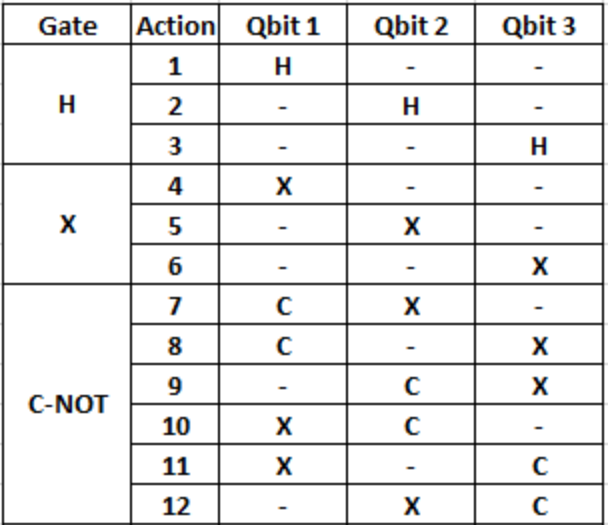
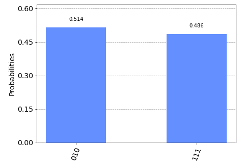
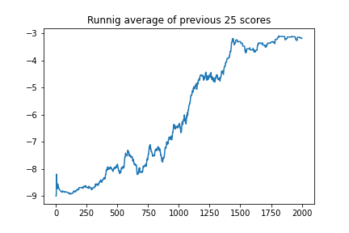
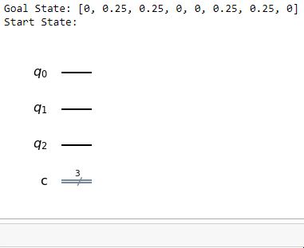

This project utilizes a Deep Q-Learning RL architecture to teach an agent to reach a desired quantum state with 3 qbits.

# Action Space: 

# State Space: 
List of 8 amplitude probabilities representing distribution of outcomes for 3 qbits. 
The indexes represent the probability of getting outcomes 000, 001, 010, 011, 100, 101, 110, and 111 respectively. 
For example, the following distribution would be represented by [0, 0, 0.514, 0, 0, 0, 0, 0.486]: 
 

# Reward Structure: 
A reward of -1 is given on every timestep except for when the agent reaches the desired state, or the environment reaches the maximum number of timesteps allotted for an episode, in which case a reward of 0 is given.  This incentivizes the agent to reach the desired quantum state in as little actions as possible to achieve the smallest negative reward.

# Hyperparameters: 
See "Hyperparameters and Goal State Specification" section of RL-Quantum-State-Prep.ipynb

# Results: 
The graph below represents the running average score of the past 25 episodes on each episode in the training.  The agent solves the environment optimally on episode 1405 where it obtains an average score of -3 over 25 episodes.  When I set the goal state of the environment it did indeed take me 3 gates (actions) in order to reach it, however I decided to let the agent train longer to see if it would discover an even more optimal circuit. 
 
The short gif below shows an agent making actions in the environment and arriving successfully at the desired state.

# Future Research Ideas: 
* Initialize the starting state of the environment randomly to see if the agent can learn to reach the desired state from any arbitrary starting point.  This would cause the agent to have more "knowlege" in its neural network and be able to make effective decisions in a wider range of situations.
* Expand the number of gates an agent can place in a single timestep.
* Tune hyperparameters furthur to see if it can learn in less episodes.
* Modify architecture to include some recent RL innovations such as prioritized experience replay.
* See if I can teach an agent to 'learn' an established quantum algorithm like Deutsch–Jozsa or Quantum Teleportation.
* Tweak the reward structure to give a negative reward proportional to how far away a given state is from the goal state, this may help the agent learn faster.

